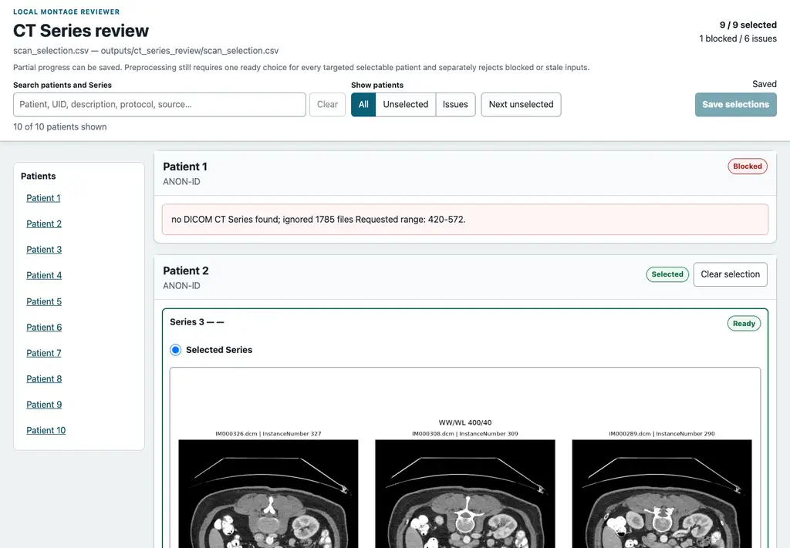

# Pancreatic Cancer Image Preprocessing

This repository implements the image modality of the pancreatic adenocarcinoma recurrence
project: workbook-driven DICOM curation, frozen SPECTRE-Large and Merlin image embeddings, and
independent recurrence classifiers. It reads each approved Turkish spreadsheet row's
`Görüntü alanı` slice range, copies the selected slices into a curated folder, and encodes a crop
centered on the complete selected CT range.

The included labels and splits are deliberately provisional pipeline-smoke inputs, not a
scientific recurrence model or evaluation.

## Setup

Install the project, imaging dependencies, and development tools:

```shell
uv sync --extra imaging --group dev
```

Run commands through `uv run`; no separate interpreter or hardware-specific constraints file is
required. PyTorch uses the first available CUDA device, then Apple MPS, and otherwise CPU.

### Google Colab

Open `pc_recurrence_colab.ipynb` in Google Colab for a GPU-ready, resumable SPECTRE embedding
workflow that clones this repository, installs the pinned environment, and stores the ignored
dataset and generated artifacts in Google Drive. Read the notebook prerequisites first; patient
data and curated DICOMs are deliberately absent from Git.

## CT series curation

Source DICOM and the workbook are read from `dataset/`, which remains read-only. Generated review
and curated DICOM artifacts default to `outputs/`; no default command writes inside `dataset/`.

Create an operator review inventory:

```shell
uv run pc-image-data inventory
```

This CPU-only command scans the source recursively and writes
`outputs/ct_series_review/scan_selection.csv` plus axial montages under
`outputs/ct_series_review/previews/`. A DICOM Study groups an imaging encounter; a Series identifies
one acquisition within that Study. Review the Study/Series descriptions, `status`, concrete
`reason`, geometry warnings, and preview for every candidate.
`ready` means the classic single-frame CT series can map the workbook's zero-based inclusive
`Görüntü alanı` ordinals after ascending `InstanceNumber`. `not_selectable` candidates remain
visible for audit, including unsupported dose-report objects. `no_series` identifies a missing
folder or a folder without usable CT DICOM.

Open the loopback-only montage reviewer:

```shell
uv run pc-image-data review
```

The reviewer keeps every patient and series in inventory order, shows the original montage at full
resolution, and changes only `selected` cells when **Save selections** is pressed. It never chooses
a series automatically. Partial progress and explicit clears are allowed; use `--selection FILE`
for another inventory, `--port` for a different loopback port, or `--no-open-browser` to print the
URL without launching a browser.



Choose exactly one `ready` row per patient in the reviewer, or set `selected=yes` directly in the
CSV and leave every other `selected` cell blank. Then curate:

```shell
uv run pc-image-data preprocess
```

Preprocessing validates the complete CSV against the live source before touching the curated
output under `outputs/dicom_selected`. An added or removed series, changed SOP membership, changed
file counts, or changed workbook range makes the selection stale and requires rerunning
`inventory`. The chosen Study and Series is deduplicated by SOP Instance UID only when duplicate
files are byte-identical. The workbook range is applied within that series, and the exact resulting
file set atomically replaces any older curated range. Existing review work is protected unless
`inventory --force` is used; that flag deliberately resets selections and previews.
`preprocess --force` stages and rebuilds the exact selected output.

Both commands accept `--patients "Patient 1,PATIENT853534"` with workbook IDs or DICOM folder
aliases. Inventory and preprocessing then require choices only for that explicit subset. Use the
same subset for both commands.

Audit the curated series geometry without modifying it:

```shell
uv run pc-image-data inspect
```

Preprocessing fails closed unless every targeted patient has one live `ready` choice. Geometry
gaps and duplicate slice positions are warnings rather than selection blockers. Study UID, Series
UID, selected SOP Instance UIDs, and geometry warnings remain in the curation and inspection
manifests.

If a workbook row has no `ready` CT series (for example, no usable images), preprocessing retains
it as an audited skip and continues curating the rest of the cohort by default:

```shell
uv run pc-image-data preprocess
```

This only permits an unselected patient that has no live `ready` candidate. It still fails
for an omitted selection where a ready candidate exists, or for a selected-series curation error.
The resulting manifest records the skipped patient. Embedding also skips missing or invalid
curated patient folders by default and records them in the embedding summary and run manifest. Use
`--require-all` with either command to restore the former strict all-patients-must-be-valid gate.

## Image embeddings

The `pc-image-embed` pipeline consumes the curated DICOM folders produced by
`pc-image-data preprocess`. It loads each workbook-selected CT series range directly. Select a
backend with `--encoder spectre|merlin`:

```shell
uv run pc-image-embed run --encoder spectre
uv run pc-image-embed run --encoder merlin
```

`--dicom-root` defaults to `outputs/dicom_selected`, and `--workbook` defaults to the source
workbook. The command uses the same environment created by `uv sync`. Use `embed` instead of `run`
to require an already cached checkpoint. `--patients`, `--run-dir`, `--resume`, and `--force` are
supported.

Both encoders center their input on the geometric center of the complete selected CT range. The
center voxel, selected Study/Series identifiers, SOP Instance UIDs, and a hash of the selected
series are recorded per patient.

The backends are pinned and save float32 embeddings without L2 normalization:

- [SPECTRE-Large](https://github.com/cclaess/SPECTRE) preserves native spacing, extracts the
  centered 128 x 128 x 64 crop, and saves the 1,080-value scan CLS token. Its model weights are
  CC-BY-NC-SA and restricted to non-commercial use.
- [Merlin](https://github.com/StanfordMIMI/Merlin) reorients to RAS, resamples to
  1.5 x 1.5 x 3 mm, clips `[-1000, 1000]` HU into `[0, 1]`, extracts the centered
  224 x 224 x 160 input, loads only the I3ResNet image substate, and saves its 2,048-value pooled
  embedding.

Package versions, Hugging Face revisions, checkpoint SHA-256 values, and the source curation
manifest hash are recorded in every run manifest. The runtime also records the selected device
type and name.

Each run writes:

- `image_embeddings.npz`: aligned patient IDs, encoder name, and the fixed float32 matrix.
- `patch_embeddings.npz`: patch/scan token vectors, locations, and valid-voxel counts.
- `embedding_summary.csv`: one audit row per selected CT range.
- `run_manifest.json`: input/model hashes, preprocessing, pooling, runtime, and failures.

## Recurrence classification

`pc-recurrence-classify` trains independent affine recurrence heads over completed Merlin and
SPECTRE patient-embedding runs. The workbook `nüks` value `yok` (trimmed and case-insensitive) is
the negative class; every other populated value is positive. Training joins patients by workbook
patient ID, verifies that both encoders used the same selected CT series provenance, and uses one
shared holdout split without combining the encoder features.

```mermaid
flowchart TB
    subgraph merlin["Merlin recurrence head — trained independently"]
        direction LR
        M0["Pooled Merlin embedding<br/>float32 [2048]"]
        M1["Feature standardization<br/>(x - mean) / scale<br/>mean [2048], scale [2048]"]
        M2["Affine layer<br/>Linear(2048 → 1)<br/>weight [1, 2048], bias [1]"]
        M3["Logit<br/>scalar"]
        M4["Sigmoid<br/>probability scalar"]
        M5["Threshold<br/>p ≥ configured threshold<br/>default 0.5"]
        M0 --> M1 --> M2 --> M3 --> M4 --> M5
    end

    subgraph spectre["SPECTRE recurrence head — trained independently"]
        direction LR
        S0["Pooled SPECTRE embedding<br/>float32 [1080]"]
        S1["Feature standardization<br/>(x - mean) / scale<br/>mean [1080], scale [1080]"]
        S2["Affine layer<br/>Linear(1080 → 1)<br/>weight [1, 1080], bias [1]"]
        S3["Logit<br/>scalar"]
        S4["Sigmoid<br/>probability scalar"]
        S5["Threshold<br/>p ≥ configured threshold<br/>default 0.5"]
        S0 --> S1 --> S2 --> S3 --> S4 --> S5
    end
```



Each head has one learned affine layer and no hidden layers. Training computes feature-wise
standardization statistics on the fit cohort, then optimizes class-weighted binary cross-entropy
plus an L2 weight penalty with LBFGS. The persisted model stores the mean, scale, weight, bias, and
decision threshold. Merlin and SPECTRE produce separate predictions; their features and logits are
never fused.

```shell
uv run pc-recurrence-classify train \
  --merlin-run "outputs/image_embeddings/<merlin-run>" \
  --spectre-run "outputs/image_embeddings/<spectre-run>"

uv run pc-recurrence-classify predict \
  --model-run "outputs/recurrence_classification/<training-run>" \
  --merlin-run "outputs/image_embeddings/<merlin-run>" \
  --spectre-run "outputs/image_embeddings/<spectre-run>"
```

Training writes holdout predictions and metrics, full-cohort classifications, checksum-authenticated
safe NumPy model artifacts, and a run manifest. Prediction validates those hashes before writing
results. Metrics whose denominator is absent are `null` with a reason; a one-class holdout is not
evidence of recurrence discrimination. These outputs are provisional research artifacts.

## Verification

```shell
uv run ruff check .
uv run pytest
```
