# Pancreatic Cancer Image Preprocessing

This repository implements the image modality of the pancreatic adenocarcinoma recurrence
project: workbook-driven DICOM curation, frozen SPECTRE-Large and Merlin image embeddings, and
independent recurrence classifiers. It reads the supplied `Radyoloji Data/10Patients_Important_Slices`
workbook and the matching `IMG/CASE_*` folders, then encodes a crop centered on each supplied CT
slice set.

The included labels and splits are deliberately provisional pipeline-smoke inputs, not a
scientific recurrence model or evaluation.

## Setup

Install the project, imaging dependencies, and development tools:

```shell
uv sync --extra imaging --group dev
```

Run commands through `uv run`; no separate interpreter or hardware-specific constraints file is
required. PyTorch uses the first available CUDA device, then Apple MPS, and otherwise CPU.

### Google Colab

Open `pc_recurrence_colab.ipynb` in Google Colab for a GPU-ready, resumable SPECTRE embedding
workflow that clones this repository, installs the pinned environment, and stores the ignored
dataset and generated artifacts in Google Drive. Read the notebook prerequisites first; patient
data and curated DICOMs are deliberately absent from Git.

## CT series curation

By default, source DICOM and the workbook are read from
`../Radyoloji Data/10Patients_Important_Slices/`, relative to the repository root. The supplied
`IMG/CASE_*` folders have already been selected by radiology professionals. Curation copies their
complete CT series into `outputs/dicom_selected`; no command writes into `Radyoloji Data/`.

Curate the supplied cases directly:

```shell
uv run pc-image-data preprocess
```

Each source folder must contain exactly one processable CT series. The supplied files are retained
in full and the workbook `Görüntü alanı` value is recorded as source metadata. Duplicated SOP
instances are accepted only when their bytes match. The resulting file set atomically replaces any
older curated output; `preprocess --force` stages and rebuilds it.

Use `--patients "CASE_463046AE306C,CASE_7D0510FBD1DA"` to curate an explicit subset by workbook ID
or DICOM-folder alias.

Audit the curated series geometry without modifying it:

```shell
uv run pc-image-data inspect
```

Missing, invalid, or ambiguous folders are recorded as audited skips by default. Use
`--require-all` to return a non-zero exit when any targeted case is skipped. Geometry gaps and
duplicate slice positions are warnings; Study UID, Series UID, selected SOP Instance UIDs, and
geometry warnings remain in the curation and inspection manifests.

## Image embeddings

The `pc-image-embed` pipeline consumes the curated DICOM folders produced by
`pc-image-data preprocess`. It loads each professionally selected CT series directly. Select a
backend with `--encoder spectre|merlin`:

```shell
uv run pc-image-embed run --encoder spectre
uv run pc-image-embed run --encoder merlin
```

`--dicom-root` defaults to `outputs/dicom_selected`, and `--workbook` defaults to the source
workbook. The command uses the same environment created by `uv sync`. Use `embed` instead of `run`
to require an already cached checkpoint. `--patients`, `--run-dir`, `--resume`, and `--force` are
supported.

Both encoders center their input on the geometric center of the complete selected CT range. The
center voxel, selected Study/Series identifiers, SOP Instance UIDs, and a hash of the selected
series are recorded per patient.

The backends are pinned and save float32 embeddings without L2 normalization:

- [SPECTRE-Large](https://github.com/cclaess/SPECTRE) preserves native spacing, extracts the
  centered 128 x 128 x 64 crop, and saves the 1,080-value scan CLS token. Its model weights are
  CC-BY-NC-SA and restricted to non-commercial use.
- [Merlin](https://github.com/StanfordMIMI/Merlin) reorients to RAS, resamples to
  1.5 x 1.5 x 3 mm, clips `[-1000, 1000]` HU into `[0, 1]`, extracts the centered
  224 x 224 x 160 input, loads only the I3ResNet image substate, and saves its 2,048-value pooled
  embedding.

Package versions, Hugging Face revisions, checkpoint SHA-256 values, and the source curation
manifest hash are recorded in every run manifest. The runtime also records the selected device
type and name.

Each run writes:

- `image_embeddings.npz`: aligned patient IDs, encoder name, and the fixed float32 matrix.
- `patch_embeddings.npz`: patch/scan token vectors, locations, and valid-voxel counts.
- `embedding_summary.csv`: one audit row per selected CT range.
- `run_manifest.json`: input/model hashes, preprocessing, pooling, runtime, and failures.

## Clinical variables and CT report text

Create patient-aligned clinical train and validation tables from the same source workbook:

```shell
uv run pc-clinical-data preprocess
```

The command writes a timestamped run under `outputs/clinical_features/`, including a split-labeled
audit table `clinical_raw.csv`, separate `clinical_raw_train.csv`, `clinical_raw_validation.csv`,
`clinical_features_train.csv`, and `clinical_features_validation.csv` tables plus
`split_assignments.csv`. It creates a deterministic
patient-level split (20% validation by default), fits z-score normalization, mean imputation, and
categorical vocabularies on the training patients only, then applies those fitted parameters to
the validation patients. The recurrence value is written separately as `target_recurrence`; the
hospital number and CT slice range are excluded from the model features. A `CA 19-9` value such as
`<2` uses the recorded upper bound as its numeric value and sets
`ca_19_9_below_detection_limit=1`.

Both raw and processed tables preserve each `BT raporu` value as `ct_report_text`. The
split-specific raw training table is the authoritative cleaned input for later model fitting. The
split-labeled `clinical_raw.csv` table is provided for cohort-wide audit only and must not be used
to fit preprocessing. The processed tables are derived from the training-only preprocessing
parameters and are safe to audit separately by split. CT report text is not yet a model feature:
the preprocessing manifest marks text embedding as pending so a pinned text model can add report
embeddings in a later stage. `preprocessing_parameters.json` records every training-fit mean, scale,
missing-value policy, category vocabulary, and final feature column. `run_manifest.json` hashes the
source workbook and every generated artifact.

The default split seed is recorded in the manifest and can be changed with `--split-seed`. Use
`--validation-fraction` to select another validation proportion. The optional `--fit-patients`
argument can restrict fitting further to a subset of the generated training patients; validation
patients can never be used to fit preprocessing. Categories unseen in the fit subset map to an
explicit `unknown` column.

## CT report embeddings

Embed the `ct_report_text` documents from a completed clinical preprocessing run with the pinned
[Qwen/Qwen3-Embedding-8B](https://huggingface.co/Qwen/Qwen3-Embedding-8B) snapshot:

```shell
uv sync --extra imaging --extra text --group dev
uv run --extra text pc-text-embed run \
  --clinical-run outputs/clinical_features/<clinical-run>
```

The stage verifies the clinical run manifest and the hashes of both split-specific raw tables before
reading report text. It writes separate `text_embeddings_train.npz` and
`text_embeddings_validation.npz` files with patient IDs and float32, L2-normalized 4,096-dimensional
vectors. `embedding_summary.csv` contains one auditable row per patient without duplicating report
text, and `run_manifest.json` records the fixed Hugging Face revision, config/tokenizer/index hashes,
pooling, token limits, runtime, source split, and output hashes.

Reports are embedded as documents without a retrieval instruction, using the model-card-recommended
last-token pooling. The command uses an 8,192-token maximum and batch size 1 by default because the
8B model has substantial memory requirements. Use `uv run --extra text pc-text-embed embed` instead
of `run` when the pinned snapshot is already present in `.cache/text_models` and must not be
downloaded. Missing report text is skipped by default and logged; `--require-all` turns it into an
error.

## Recurrence classification

`pc-recurrence-classify` trains independent affine recurrence heads over completed Merlin and
SPECTRE patient-embedding runs. The supplied workbook's `Nüks Binary` value maps directly from
`0` (negative) and `1` (positive). Legacy workbooks retain their `nüks` handling, where `yok`
(trimmed and case-insensitive) is the negative class. Training joins patients by workbook
patient ID, verifies that both encoders used the same selected CT series provenance, and uses one
shared holdout split without combining the encoder features.

```mermaid
flowchart TB
    subgraph merlin["Merlin recurrence head — trained independently"]
        direction LR
        M0["Pooled Merlin embedding<br/>float32 [2048]"]
        M1["Feature standardization<br/>(x - mean) / scale<br/>mean [2048], scale [2048]"]
        M2["Affine layer<br/>Linear(2048 → 1)<br/>weight [1, 2048], bias [1]"]
        M3["Logit<br/>scalar"]
        M4["Sigmoid<br/>probability scalar"]
        M5["Threshold<br/>p ≥ configured threshold<br/>default 0.5"]
        M0 --> M1 --> M2 --> M3 --> M4 --> M5
    end

    subgraph spectre["SPECTRE recurrence head — trained independently"]
        direction LR
        S0["Pooled SPECTRE embedding<br/>float32 [1080]"]
        S1["Feature standardization<br/>(x - mean) / scale<br/>mean [1080], scale [1080]"]
        S2["Affine layer<br/>Linear(1080 → 1)<br/>weight [1, 1080], bias [1]"]
        S3["Logit<br/>scalar"]
        S4["Sigmoid<br/>probability scalar"]
        S5["Threshold<br/>p ≥ configured threshold<br/>default 0.5"]
        S0 --> S1 --> S2 --> S3 --> S4 --> S5
    end
```



Each head has one learned affine layer and no hidden layers. Training computes feature-wise
standardization statistics on the fit cohort, then optimizes class-weighted binary cross-entropy
plus an L2 weight penalty with LBFGS. The persisted model stores the mean, scale, weight, bias, and
decision threshold. Merlin and SPECTRE produce separate predictions; their features and logits are
never fused.

```shell
uv run pc-recurrence-classify train \
  --merlin-run "outputs/image_embeddings/<merlin-run>" \
  --spectre-run "outputs/image_embeddings/<spectre-run>"

uv run pc-recurrence-classify predict \
  --model-run "outputs/recurrence_classification/<training-run>" \
  --merlin-run "outputs/image_embeddings/<merlin-run>" \
  --spectre-run "outputs/image_embeddings/<spectre-run>"
```

Training writes holdout predictions and metrics, full-cohort classifications, checksum-authenticated
safe NumPy model artifacts, and a run manifest. Prediction validates those hashes before writing
results. Metrics whose denominator is absent are `null` with a reason; a one-class holdout is not
evidence of recurrence discrimination. These outputs are provisional research artifacts.

## Verification

```shell
uv run ruff check .
uv run pytest
```
